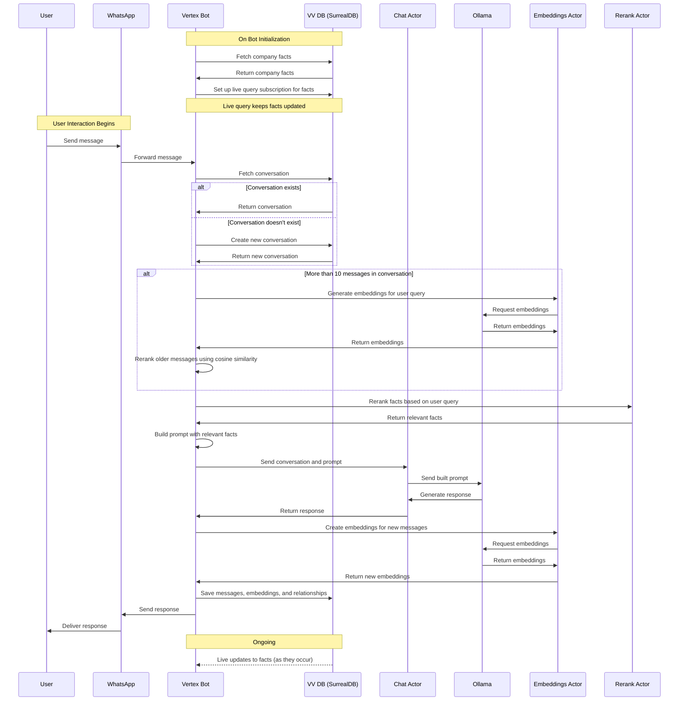

# BuilderBot SDK Chatbot with Baileys

This project uses the BuilderBot SDK to create a chatbot with Baileys. Follow the instructions below to install and configure it.

## Prerequisites

- Node.js version 22.8.0 or higher
- MongoDB version 6.6.1 or higher
- Imgur API key
- OpenAI API key
- Rust and Cargo installed
- Updated OpenSSL version (OpenSSL 3.0.12 24 Oct 2023 (Library: OpenSSL 3.0.12 24 Oct 2023))

## Setup Instructions

It is advisable to check first the [veoveo](https://github.com/VertexStudio/veoveo) repository to ensure all the requirements are met.

1. Clone and set up the veoveo repository:

   ```bash
   mkdir -p ~/vertex && cd ~/vertex
   git clone https://github.com/VertexStudio/veoveo
   cd veoveo
   ```

2. Start SurrealDB:

   ```bash
   surreal start --user root --pass root surrealkv:assets/vv_db
   ```

3. Run the required services (each in a separate terminal):

   ```bash
   docker compose up -d
   cargo run -p rerank
   cargo run -p embeddings
   cargo run -p vv_vision
   ./run.sh cargo run --release -p asset_pipeline -- --comfy
   ```

4. Clone and set up the bioma repository:

   ```bash
   cd ~/vertex
   git clone https://github.com/VertexStudio/bioma
   cd bioma
   docker compose up reranker
   ```

5. Clone this repository:

   ```bash
   cd ~/vertex
   git clone https://github.com/VertexStudio/vertex-bot-wsp
   cd vertex-bot-wsp
   ```

6. Configure the .env file:

   Copy the `.env.example` file to `.env` and fill in the required values:

   ```bash
   cp .env.example .env
   ```

   Then edit the `.env` file with your specific values:

   - ASSISTANT_ID=
   - OPENAI_API_KEY=
   - MONGODB_URI=
   - IMGUR_CLIENT_ID=
   - MODEL= (Optional, default is "llama3.1")
   - etc...

7. Install dependencies and start the bot:

   ```bash
   pnpm i
   pnpm dev
   ```

8. Scan the QR code from the bot.qr.png file with WhatsApp

## Group Validations

1. Copy the groupsValidationFeature/index.cjsnode_modules/@builderbot/provider-baileys/dist/index.cjs
2. Paste and replace on

## Additional Requirements

Ensure the following services are running:

1. vv_vision
2. ComfyUI
3. vv_db
4. Ollama
5. Reranker service
6. Embeddings service

## Architecture


